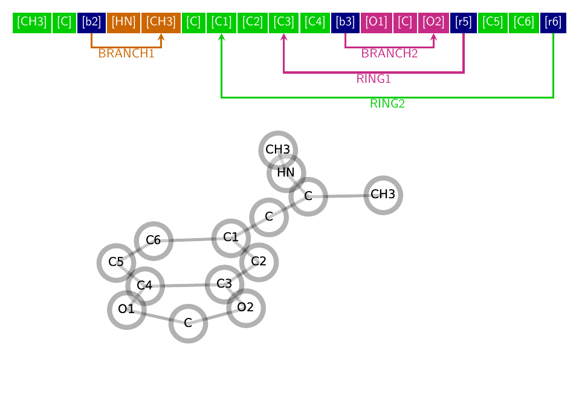
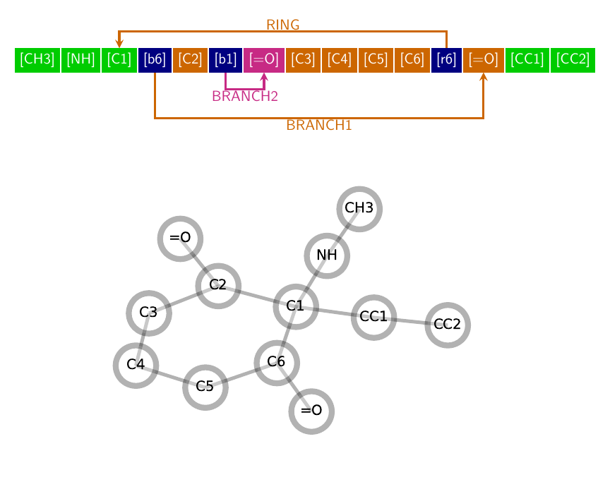

# moleculegraph

simple undirected graph representation for molecules and more...

Online documentation is available at [maxfleck.github.io/moleculegraph](https://maxfleck.github.io/moleculegraph/moleculegraph.html)

**Install**

pip install -I .

or

python setup.py install

**moleculegraph**

- main goal: write code about molecules without the need to care abput molecules

- easy semantics, agnositc against syntax

- string representation to describe molecules with focus on force-fields and easy mapping

- high flexibillity for naming your beads/atoms/whatever (b and r might have a negative impact. Maybe change)
    
- not limited to small molecules i.e. branches and rings are possible (works for amino acids and therefore proteins too)

**syntax**

- [b] encodes the branch operator, [r] encodes the ring operator
- the number after the operator determines its range 
- branches point forward, rings backwards 
- operators refer to the subchain of the last atom before the operator 
- subchains are skipped if completely enclosed by the operator       
- ...so that the number after the operator always corresponds to the number of atoms in the encoded substructure :) 

**future**

- dummy operator to be able to code binding types, for example
- allow different, user definable branch and ring operators
